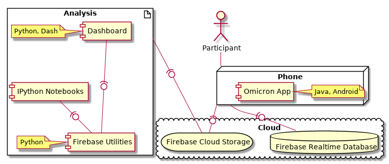

# Omicron
An Android app aimed for research on Mobile Information Retrieval. Developed at Università della Svizzera italiana (USI), Lugano, Switzerland.

## Requirements

This application need a [Firebase account](https://firebase.google.com/) to work.

An account for Crashanalytics is needed for Crash Analytics reporting

Qualtrics is used for the questionnaires. The link for the questionnaires are in MainActivity (openSurvey, onStartTask, OpenPostTaskQuestionnaire).
TaskBrowserActivity uses an interceptor to know when the user has finished a questionnaire, the url that Qualtrics use might change in the future. 

A [Bing Web Search API](https://azure.microsoft.com/en-us/services/cognitive-services/bing-web-search-api/) subscription is needed to use web search capabilities 
The key need to be set in Configuration.java BING_KEY

## Usage

This application can be used for task-based user studies in mobile IR. With some minor modifications, it can also be used for various types of studies in mobile IR, enabling researchers to build mobile search query log enrcihed by users interactions as well as other contextual/sensor data. Previously, we have modified Omicron to build a query log for universal mobile search (code can be accessed here: [uSearch](https://github.com/aliannejadi/usearch), data can be accessed here: [ISTAS](https://github.com/aliannejadi/istas)).
 
Sensors data from participants' smartphones are collected for the duration of a study. The collected data
is routinely uploaded to the cloud (Firebase Storage) for easy access and analysis.

Tasks can be scheduled in advance and participants are informed by a notification 
 

## Quick Start

In order to run Omicron, follow the steps below:

1. Change the project's package name. To do so, follow this [useful post](https://stackoverflow.com/questions/16804093/android-studio-rename-package) on Stackoverflow.
2. Create a new project on Firebase and add the new package name in your project. Note that uSearch uses Firebase "Storage" service.
3. Create a new bucket on Firebase Storage.
4. Download "google-services.json" file and add it to the project under: Omicron/app/src
    Configure the app to connect to your Fabric account.
5. The app's survey data is available only to the authors, therefore you should update its link to your own survey. The code can be found in Configuration.java.
6. Build your first APK file!

## Enable/Disable Sensors

To enable/disable the gathering of a sensor edit Configuration.java:

Add the constant of the sensor to the array to send collected data on Wifi networks
 
__filesNamesList__

If the data need to be uploaded using mobile data are available add it also to

__lightFilesNamesList__

To stop the gathering of a sensor set the corresponding flag to false.

## Tasks

Tasks need to be defined in the Firebase Realtime database.

The structure of the database need to be the following:

- The first node is the appid of the user that can be retrieved from the application
-  "tasks"
- YYYY-MM-DD (date)
- task-id (can be choose freely but must be unique)
- the task

The structure of a task is the following:

- description text 
- title text
- windowStart : hour e.g. 16
- windowEnd : hour e.g. 18 (the extreme is not included)
- done: initially false
- doneTimestamp/startTimestamp: initially -1

## Modify Sensor/Data Sample Rate

For the majority of the data that uSearch collects, data is collected based on interrupts. However, some of the sensor data such as GPS are still based on polling. Moreover, the data is written to the memory of the phone at a certain rate to clean the phone's RAM. All these rates can be modified in the class named Configuration. 

## Data Format

All the sensor, interaction, and input data are stored in JSON files and pushed to a Firebase storage bucket. The sampled data are stored in one file per each data type (e.g., location data, battery data, etc.). At every "recordRate", the available data batch is stored in a single file named [record type]_records_[timestamp].json. For example, the location data at timestamp 1539284954 will be stored in a JSON file named location_records_1539284954.json. Every such file is stored under a directory named user + [user id], where user id is the phone's unique ID. Below is an example JSON file for battery records:

    {
       "health":"good",
       "level":23,
       "plugged":"?",
       "scale":100,
       "status":"discharging",
       "temperature":333,
       "timestamp":1523766100661,
       "voltage":3692
    }

## Notification

Users can delay a task and it's reissued in the next time slot or it is piggybacked at the end of another task if the next slot is already occupied by a task.

## Contact
Please do feel free to contact us for any questions.
    Mohammad Aliannejadi: mohammad.alian.nejadi@usi.ch

## Acknowledgements

We would like to thank Jacopo Fidacaro and Luca Costa for their efforts in developing this app. Last but not least, we would like to thank all the participants who helped us improve the app and collect data.

## Citation

    @inproceedings{AliannejadiChiir19,
        author    = {Aliannejadi, Mohammad and Harvey, Morgan and Costa, Luca and 
                     Pointon, Matthew and Crestani, Fabio},
        title     = {Understanding Mobile Search Task Relevance and User Behaviour in Context},
        booktitle = {Proceedings of the {ACM} {SIGIR} Conference on 
                     Human Information Interaction and Retrieval},
        series    = {{CHIIR '19}},        
        location  = {Glasgow, UK},          
        year      = {2019}
      }
